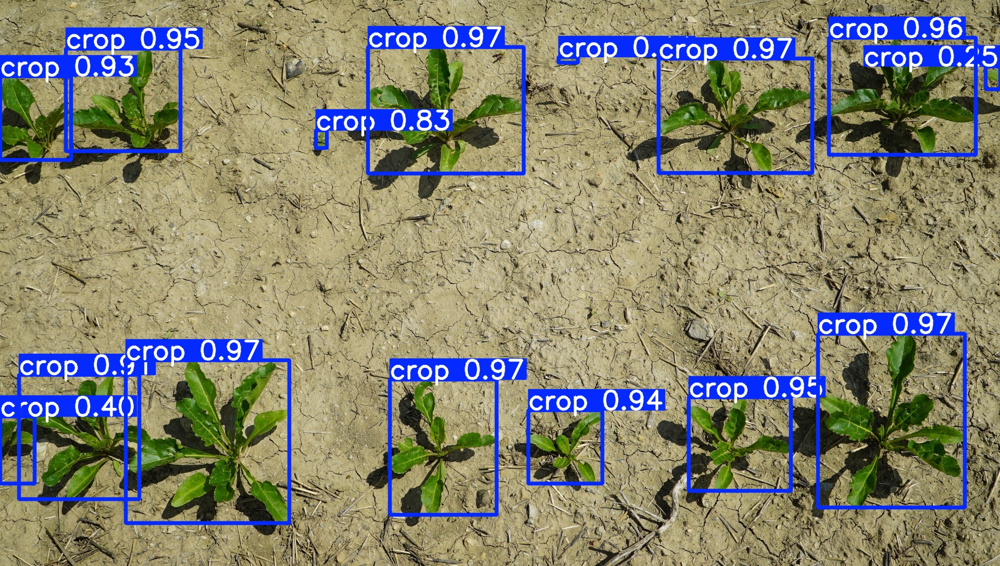

# Plants

## Object Detection Instructions

For powershell, but should be easy enough to modify for other shells

### Setup

Requirements:

- python3 (`python3 -m venv .venv` recommended)
- [pytorch](https://pytorch.org/get-started/locally/)
- `pip install -r ./requirements.txt`

### Training

```pwsh
python3 ./setup.py  # will take a while to download
python3 ./transform.py
python3 ./split.py
yolo settings datasets_dir=$pwd
yolo detect train model=yolo11s.pt data="./dataset.yml" cache=disk
```

### Prediction

```pwsh
yolo predict model=runs\detect\train\weights\best.pt source=images\ave-0506-0007.jpg
```


